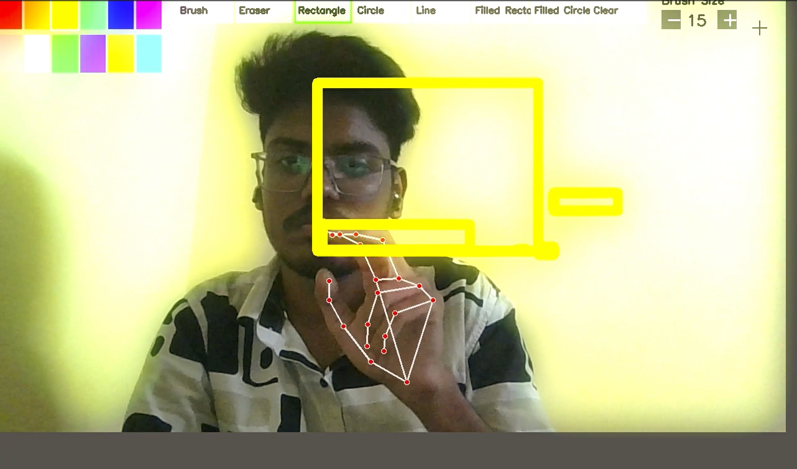

# 🖌️ Virtual Painter

If you find this project helpful or inspiring, please consider ⭐ starring the repository and supporting its growth!

## 🌟 Why Star This Repository?
- Increases visibility of my work
- Encourages further development and feature upgrades
- Supports open-source innovation for creative tech

🔗 **[GitHub Repository - Click here to Star](https://github.com/221fa04470/virtual-painter)**

---

## ✨ Features
- 🖐️ **Gesture + Mouse Support**: Draw with your fingers or the mouse
- 🖌️ Drawing Tools:
  - Brush
  - Eraser
  - Rectangle (outline and filled)
  - Circle (outline and filled)
  - Line Tool
- 🎨 **Color Palette**: 12 vibrant preset colors
- ➕➖ **Brush Size Adjustment**: Fine control using `+` and `-` buttons
- 🖐️ **MediaPipe Hand Tracking**: Pinch gesture to draw or place shapes
- 🧹 **Canvas Clearing**: Instantly reset your workspace
- 🧼 **Clean UI**: Interactive top-panel with tool and color selection
- ⚡ **Smooth Experience**: Uses point averaging for stable line rendering

---
## 🖼️ Preview



## 💻 System Requirements
- Python 3.6+
- Webcam (internal or external)

### 📚 Libraries Used
- `OpenCV (cv2)`
- `MediaPipe`
- `NumPy`

---

## 📦 Installation

```bash
git clone https://github.com/221fa04470/virtual-painter.git
cd virtual-painter
pip install opencv-python numpy mediapipe
python virtual_painter.py
